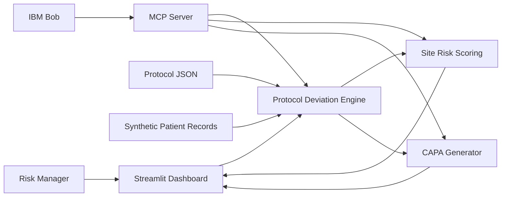

# Architecture

## Components

| Component | Technology | Responsibility |
|---|---|---|
| Dashboard | Streamlit | Upload records, inspect findings and site risk |
| Protocol | JSON | Machine-readable study rules |
| Deviation engine | Python/Pandas | Deterministic record-vs-protocol comparison |
| Risk engine | Python/Pandas | Leading-indicator scoring |
| CAPA generator | Python | Evidence-linked draft actions |
| Bob integration | MCP | Expose analysis and CAPA tools to IBM Bob |
| Data | CSV | Synthetic demonstration records |

## Security
No real patient data should be committed. Credentials belong in environment variables and `.gitignore`. For real deployments, identity, access control, encryption, audit logging and data minimization would be mandatory.

## Scalability
The deterministic engine can be moved behind an API and database for larger datasets. Site scoring can be computed incrementally as new records arrive.

## IBM Bob
Bob can connect to a project-level MCP server through `.bob/mcp.json`. IBM's documentation describes MCP as the mechanism for connecting Bob to external tools/data and supports project-level configurations. citeturn0search0turn0search1
